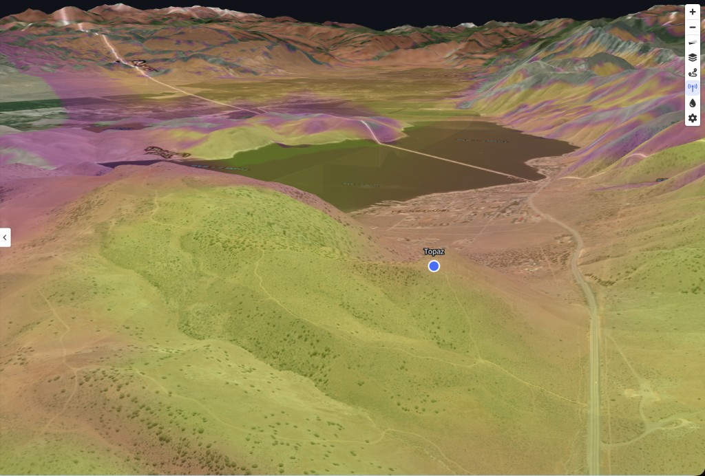
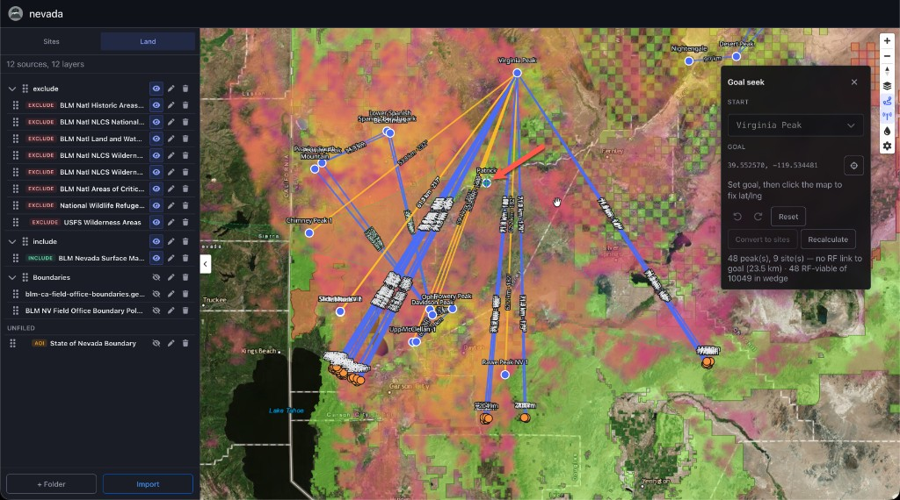
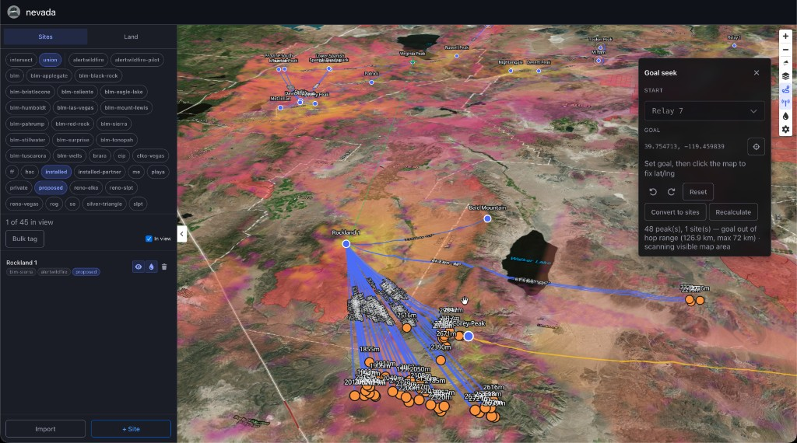

# Peaky Finders

Peaky Finders is a next-generation mesh planning tool with a completely rewritten RF viewshed calculator. Building on prior art such as [SPLAT](https://www.qsl.net/kd2bd/splat.html), it uses modern CPU cores and is optimized for calculating LoRa mesh RF viewsheds.

Peaky Finders includes a link solver that finds multi-hop repeater routes through catalog peaks between two sites, using only land you have marked as eligible. Out here in Nevada, that means feeding Peaky BLM and USFS overlays to keep repeaters on public land and off private property. We used Peaky Finders to plan a mesh network around the entire state, complete with fault tolerance and redundancy.

Everything lives in YAML. Peaky consumes GeoJSON and most shapefile sources natively. Contributions are welcome, especially if you have ideas for improving or tuning viewshed calculations. See [CONTRIBUTING.md](CONTRIBUTING.md) for build and development setup.







## Install

Download a release for your platform from [GitHub Releases](https://github.com/MeshEnvy/peaky-finders/releases):

| Platform | Archive |
|----------|---------|
| Linux x86_64 | `peaky-*-x86_64-unknown-linux-gnu.tar.gz` |
| macOS Apple Silicon | `peaky-*-aarch64-apple-darwin.tar.gz` |
| macOS Intel | `peaky-*-x86_64-apple-darwin.tar.gz` |

Extract the archive. It contains a single `peaky` binary. Put it on your `PATH`, or run it from the directory where you extracted it.

## Run

```bash
peaky serve /path/to/project --port 8080
```

Open `http://127.0.0.1:8080/`.

From source (debug is fine for UI; `--release` for long RF):

```bash
cargo run -p peaky -- serve /path/to/project --host 127.0.0.1 --port 8080
```

If `/path/to/project` is missing or has no `config.yaml` yet, Peaky creates the directory and writes a starter `config.yaml` with typical MeshCore modem and RF defaults. Add sites and land layers from the web UI.

Skadi tiles and RF cache live under `<project>/.peaky/cache/`.

### Project files

| File | Contents |
|------|----------|
| `config.yaml` | RF presets, simulation, display, scan, links (required) |
| `sites.yaml` | `sites:` map (optional split file) |
| `land.yaml` | Eligible land layers (optional split file) |

Peaky merges split files at load time. Small projects can keep everything in one `config.yaml`.

### Official base export

Publish a compact project others can run without your `data/` tree or GDB sources:

```bash
peaky freeze /path/to/project
peaky serve /path/to/project/my-project-base-2026-08-22 --port 8080
```

Default output: `<project>/{slug}-base-{date}/` with `config.yaml`, `project.geojson`, and `freeze.json`. Land attribute filters are executed at export; only baked geometry is kept. Pass `--include-sites` to embed the site list. Override the directory with `-o DIR` (must be empty).

### Land imports

GeoJSON works out of the box. File Geodatabase (`.gdb`) imports need [GDAL](https://gdal.org/) installed (`ogr2ogr` on your `PATH`).
