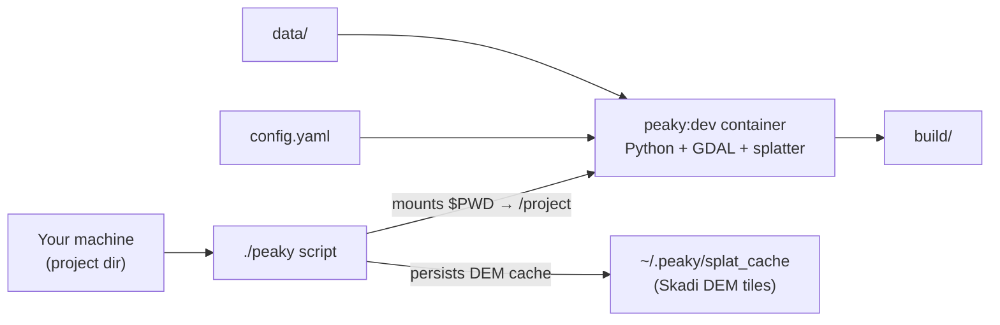

# Peaky Finders

Peaky Finders plans mesh RF site coverage: clip and composite GIS bundle layers, run viewsheds, compute mesh connectivity, and assemble an aggregate **KMZ** for Google Earth.

One **project** is a directory containing **`config.yaml`** (the preset), optional **`data/`** inputs, and generated **`build/`** outputs.

## Prerequisites

- **Docker** — all CLI use goes through [`./peaky`](peaky); no local Python or GDAL install needed.
- **Git submodules** — the Rust **splatter** extension lives in [`splatter/`](splatter/) and is built inside the image:

```bash
git clone --recurse-submodules <repo-url>
# or, after a plain clone:
git submodule update --init
```

## Docker and Python

You run **`./peaky`** on your machine. It builds (if needed) and runs the **`peaky:dev`** Docker image, which contains Python, GDAL, and the splatter viewshed extension. Your project directory is mounted into the container; the CLI reads **`./config.yaml`** from that directory.



- **`./peaky`** mounts your **current directory** as `/project` and runs the `peaky` CLI inside the container.
- The CLI **requires `./config.yaml`** in that directory — always `cd` into your project first.
- Application code lives in [`peaky_finders/`](peaky_finders/); operators do not need to edit it.
- Skadi DEM tiles are cached on the host at **`~/.peaky/splat_cache`** (override with **`PEAKY_CACHE_DIR`**).

The first `./peaky` run builds the Docker image automatically. After Dockerfile changes, pass **`--build`** (e.g. `./peaky --build build`).

## Creating a new project

From the **repo root** (no `config.yaml` required):

```bash
./peaky new my-region
# → projects/my-region/config.yaml + data/{aoi,include,exclude}/
cd projects/my-region
../../peaky build --verbose
```

Standalone directory (scaffold in cwd):

```bash
mkdir my-region && cd my-region
../peaky new my-region --here
../peaky build --verbose
```

Edit `config.yaml`; add GDB/KML files under `data/`. List GDB layers with `peaky inspect data/aoi/your.gdb`.

Git ignores `projects/` artifacts but allows committing `projects/**/config.yaml` (see [`.gitignore`](.gitignore)).

### Manual copy (alternative)

```bash
mkdir -p my-region/data/{aoi,include,exclude}
cp peaky_finders/tests/fixtures/peaky_home/projects/sample/config.yaml my-region/config.yaml
```

### Critical rule

Always **`cd` into the project directory** before running `./peaky`. The CLI looks for **`./config.yaml`** in the current working directory; you cannot pass a preset path to `peaky build`.

## Project layout

```
my-region/
  config.yaml       # preset: RF, sites, bundle layers (required)
  data/             # bundle inputs (paths referenced in config)
    aoi/
    include/
    exclude/
  build/            # generated (gitignored)
    bundle/
    viewsheds/
    mesh/
    my-region.kmz   # final output
```

**`build/`** is incremental — reruns skip targets that are still fresh. Use **`--force`** to rebuild everything, or delete specific subtrees to force partial rebuilds.

## `config.yaml` essentials

Copy and edit the sample fixture at [`peaky_finders/tests/fixtures/peaky_home/projects/sample/config.yaml`](peaky_finders/tests/fixtures/peaky_home/projects/sample/config.yaml). JSON presets are not supported.

| Section | Purpose |
|---------|---------|
| `simulation` | RF modem/environment presets, transmitter/receiver, `radius_km`, `provider` |
| `display` | Colormap and dBm range for rasters |
| `bundle` | `inputs_root`, `aoi` / `include` / `exclude` layer groups; optional mesh and site-suggestion settings |
| `sites` | Slug → `{ name, loc: [lat, lon], sees: [...] }` mesh graph |

Discover layer names in a File Geodatabase:

```bash
../peaky inspect data/aoi/my.gdb
```

## Running builds

Run these from your project directory. Adjust the path to `./peaky` if your clone layout differs (examples assume the repo root is one level up).

| Command | What it does |
|---------|----------------|
| `../peaky build` | Full incremental build → KMZ |
| `../peaky build --verbose` | Log start/progress/end per target |
| `../peaky build -j 4` | Run up to 4 targets in parallel within a wave |
| `../peaky build --target bundle` | Bundle phase only |
| `../peaky build --target viewshed/hub` | One site viewshed (`hub` = site slug) |
| `../peaky build --dry-run` | Show what would run without executing |
| `../peaky build --force` | Rebuild all targeted nodes (ignore staleness) |
| `../peaky build --suggest` | Run site suggestion solver; append picks to preset |
| `../peaky kmz` | Reassemble KMZ without rerunning coverage |
| `../peaky bundle plss` | Populate PLSS/MLRS fields on sites |

Advanced partial rebuilds are available via `peaky bundle`, `peaky mesh`, `peaky viewshed`, and `peaky stamp` — run `../peaky --help` for subcommands.

## Outputs

- **Primary deliverable:** `build/<slug>.kmz` — slug is the project directory name when the preset is `config.yaml`.
- **Intermediate artifacts:** `build/bundle/`, `build/viewsheds/`, `build/mesh/` — useful for debugging; safe to delete to force a rebuild of that phase.

## Environment variables

| Variable | Default | When to set |
|----------|---------|-------------|
| `PEAKY_CACHE_DIR` | `~/.peaky/splat_cache` | Relocate Skadi DEM tile cache |
| `PEAKY_HOME` | repo root | Non-standard install layout |
| `PEAKY_PROJECTS` | `<PEAKY_HOME>/projects` | Custom projects root |

## Troubleshooting

| Problem | Fix |
|---------|-----|
| `config.yaml not found` | Wrong working directory — `cd` into your project |
| Missing or wrong GDB layers | Run `peaky inspect`, fix paths and layer names in `bundle.*` |
| Slow first build | DEM tiles download into the cache; later runs reuse them |
| Stale or broken build artifacts | Delete the relevant `build/` subtree, or run with `--force` |
| Need to rebuild Docker image | `./peaky --build build` |

## For developers

Python source is in [`peaky_finders/`](peaky_finders/). Run tests from the **repo root** with [`./peaky-test`](peaky-test) — do not run `poetry install` or `pytest` on the macOS host inside `peaky_finders/` (the bind-mounted `.venv` must stay Linux-only).

Production image:

```bash
docker build --target latest -t peaky:latest .
docker run --rm -v "$PWD:/project" peaky:latest build
```

Mount your project directory at `/project`; the entrypoint requires `config.yaml` there.
