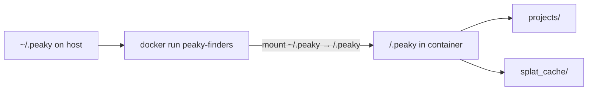

# Peaky Finders

Peaky Finders plans mesh RF site coverage: clip and composite GIS bundle layers, run viewsheds, compute mesh connectivity, and assemble an aggregate **KMZ** for Google Earth.

One **project** is a directory containing **`config.yaml`** (the preset), optional **`data/`** inputs, and generated **`build/`** outputs.

## Prerequisites

- **Docker** — pull the published **`peaky-finders`** image. No local Python, GDAL, or repo clone required.

```bash
docker pull peaky-finders
mkdir -p ~/.peaky
```

Add a shell helper (mounts **`~/.peaky`** — projects, Skadi cache, and other state live there):

```bash
peaky() {
  local workdir="/.peaky"
  case "$PWD" in
    "$HOME/.peaky"|"$HOME/.peaky"/*) workdir="/.peaky${PWD#"$HOME/.peaky"}" ;;
  esac
  docker run --rm \
    -v "$HOME/.peaky:/.peaky" \
    -e PEAKY_HOME=/.peaky \
    -w "$workdir" \
    peaky-finders "$@"
}
```

## How it runs

The container mounts **`~/.peaky`** at **`/.peaky`**. Projects live under **`~/.peaky/projects/<slug>/`**. Skadi DEM tiles cache at **`~/.peaky/splat_cache`**.

For build commands, **`cd` into a project** on the host first so the helper sets the container working directory correctly.



## Creating a new project

```bash
peaky new my-region
cd ~/.peaky/projects/my-region
peaky build --verbose
```

Edit `config.yaml`; add GDB/KML files under `data/`. List GDB layers with `peaky inspect data/aoi/your.gdb`.

### Critical rule

Always **`cd` into the project directory** before running `peaky build` (and other preset commands). The CLI reads **`./config.yaml`** from the current working directory; you cannot pass a preset path to `peaky build`.

## Data layout

```
~/.peaky/
  projects/
    my-region/
      config.yaml       # preset: RF, sites, bundle layers (required)
      data/             # bundle inputs (paths referenced in config)
        aoi/
        include/
        exclude/
      build/            # generated
        bundle/
        viewsheds/
        mesh/
        my-region.kmz   # final output
  splat_cache/          # Skadi DEM tiles (shared across projects)
```

**`build/`** is incremental — reruns skip targets that are still fresh. Use **`--force`** to rebuild everything, or delete specific subtrees to force partial rebuilds.

## `config.yaml` essentials

After `peaky new`, edit the scaffolded preset. A fuller reference lives in the repo at [`peaky_finders/tests/fixtures/peaky_home/projects/sample/config.yaml`](peaky_finders/tests/fixtures/peaky_home/projects/sample/config.yaml). JSON presets are not supported.

| Section | Purpose |
|---------|---------|
| `simulation` | RF modem/environment presets, transmitter/receiver, `radius_km`, `provider` |
| `display` | Colormap and dBm range for rasters |
| `bundle` | `inputs_root`, `aoi` / `include` / `exclude` layer groups; optional mesh and site-suggestion settings |
| `sites` | Slug → `{ name, loc: [lat, lon], … }` |
| `links` | Manual mutual pairs `[[site-a, site-b], …]` (unioned with viewshed-derived edges) |

Discover layer names in a File Geodatabase:

```bash
peaky inspect data/aoi/my.gdb
```

## Running builds

From **`~/.peaky/projects/<slug>/`**:

| Command | What it does |
|---------|----------------|
| `peaky build` | Full incremental build → KMZ |
| `peaky build --verbose` | Log start/progress/end per target |
| `peaky build -j 4` | Run up to 4 targets in parallel within a wave |
| `peaky build --target bundle` | Bundle phase only |
| `peaky build --target viewshed/hub` | One site viewshed (`hub` = site slug) |
| `peaky build --dry-run` | Show what would run without executing |
| `peaky build --force` | Rebuild all targeted nodes (ignore staleness) |
| `peaky build --suggest` | Run site suggestion solver; append picks to preset |
| `peaky kmz` | Reassemble KMZ without rerunning coverage |
| `peaky bundle plss` | Populate PLSS/MLRS fields on sites |

Advanced partial rebuilds are available via `peaky bundle`, `peaky mesh`, `peaky viewshed`, and `peaky stamp` — run `peaky --help` for subcommands.

## Web UI

```bash
docker run --rm -p 8080:8080 \
  -v "$HOME/.peaky:/.peaky" \
  -e PEAKY_HOME=/.peaky \
  peaky-finders serve
```

Open `http://localhost:8080` — project list reads from `~/.peaky/projects/`.

## Outputs

- **Primary deliverable:** `build/<slug>.kmz` — slug is the project directory name when the preset is `config.yaml`.
- **Intermediate artifacts:** `build/bundle/`, `build/viewsheds/`, `build/mesh/` — useful for debugging; safe to delete to force a rebuild of that phase.

## Environment variables

| Variable | Default (container) | When to set |
|----------|---------------------|-------------|
| `PEAKY_HOME` | `/.peaky` | Relocate the runtime home (mount host dir there) |
| `PEAKY_PROJECTS` | `<PEAKY_HOME>/projects` | Custom projects root |
| `SPLAT_CACHE` | `<PEAKY_HOME>/splat_cache` | Custom Skadi DEM cache path |

## Troubleshooting

| Problem | Fix |
|---------|-----|
| `config.yaml not found` | `cd ~/.peaky/projects/<slug>` before build commands |
| Missing or wrong GDB layers | Run `peaky inspect`, fix paths and layer names in `bundle.*` |
| Slow first build | DEM tiles download into `~/.peaky/splat_cache`; later runs reuse them |
| Stale or broken build artifacts | Delete the relevant `build/` subtree, or run with `--force` |

## For developers

This repo is for **contributors**. End users run the published Docker image above — they do not clone the repo.

Clone with submodules (Rust **splatter** extension is built into the image):

```bash
git clone --recurse-submodules <repo-url>
# or, after a plain clone:
git submodule update --init
```

**[`./peaky`](peaky)** is a dev-only wrapper: it builds/runs the **`peaky:dev`** image with a live bind-mount of [`peaky_finders/`](peaky_finders/). Pass **`--build`** after Dockerfile changes.

From the repo root:

```bash
./peaky new my-region          # → projects/my-region/config.yaml + data/
cd projects/my-region
../../peaky build --verbose
```

Run tests from the repo root with [`./peaky-test`](peaky-test) — do not run `poetry install` or `pytest` on the macOS host inside `peaky_finders/` (the bind-mounted `.venv` must stay Linux-only).

Build the production image locally:

```bash
docker build --target latest -t peaky-finders .
docker run --rm -v "$HOME/.peaky:/.peaky" -e PEAKY_HOME=/.peaky \
  -w /.peaky/projects/my-region peaky-finders build
```

| Variable | Default | Role (dev) |
|----------|---------|------------|
| `PEAKY_CACHE_DIR` | `~/.peaky/splat_cache` | Host Skadi cache mount for `./peaky` / `./peaky-test` |
| `PEAKY_DEV_IMAGE` | `peaky:dev` | Dev Docker image tag |
| `PEAKY_HOME` | repo root | Runtime home in dev container |

Git ignores `projects/` artifacts but allows committing `projects/**/config.yaml` (see [`.gitignore`](.gitignore)).
