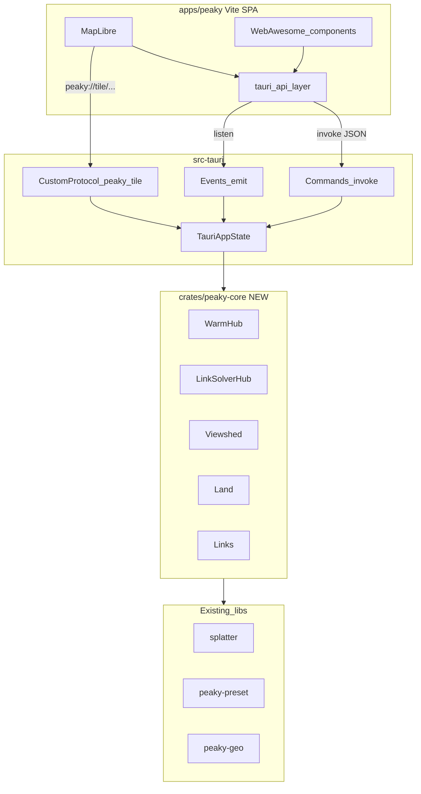

# v0.6.0 — Tauri greenfield migration

**Status:** planned (not started)  
**Target release:** v0.6.0  
**Scope:** desktop first (Windows, macOS, Linux); mobile (Android, iOS) after desktop ships.

## Principle

**No localhost shim, no dual HTTP + invoke paths.** The current `peaky serve` + Axum + rust-embed stack is reference only until parity, then **deleted**. One product surface: the Tauri app.

Matches repo greenfield policy (`.cursor/rules/greenfield-no-backcompat.mdc`): break, simplify, one way per concern.

## What stays vs what goes

| Keep (libraries) | Delete at cutover |
|------------------|-------------------|
| `splatter/` | `crates/peaky-serve/` entirely |
| `crates/peaky-preset/` | Axum, tower-http, rust-embed workspace deps |
| `crates/peaky-geo/` | `assets/` + server-rendered `assets/templates/` |
| `crates/peaky-finder/`, `crates/peaky-freeze/` | `peaky serve`, Docker default `serve /project` |
| Project YAML (unchanged) | ~40 REST routes in `crates/peaky-serve/src/api.rs` |
| `cmd/peaky` → **`find` + `freeze` only** | `assets/static/project-map/init.js` (7k lines) — port behavior, not file |

## Target architecture



### IPC model

| Today (HTTP) | Greenfield (Tauri) |
|--------------|-------------------|
| `fetch('/api/p/{slug}/sites')` | `invoke('sites_list')` → `SiteRow[]` |
| `EventSource('/api/p/{slug}/events')` | `listen('project://event', …)` — warm, viewshed ladder, scan progress |
| `GET …/splat.png`, DEM `{z}/{x}/{y}` tiles | **Custom protocol** `peaky://tile/...` (Rust reads cache, returns PNG bytes). MapLibre `tiles: ['peaky://tile/hillshade/{z}/{x}/{y}']` |
| Server HTML `project_html` | SPA boot in `index.html`; project slug from Rust app state, not URL path |
| `/api/home/modems` global routes | `invoke('catalog_modems')` — no slug in path; project is singleton in app state |

**Why custom protocol for rasters:** `invoke()` is wrong for map tiles and viewshed PNGs (volume, latency). Tauri 2 URI scheme protocol serves binary responses from Rust without an HTTP server.

## Repo layout (new)

```
peaky_finders/
  Cargo.toml                         # + peaky-core, apps/peaky/src-tauri
  crates/
    peaky-core/                      # NEW — domain orchestration (from peaky-serve body)
    peaky-preset/ peaky-geo/ splatter/ peaky-finder/ peaky-freeze/
  apps/peaky/                        # NEW — primary product
    package.json                     # vite, maplibre-gl, @tauri-apps/api
    index.html
    src/
      main.ts
      map/                           # MapLibre setup, layers, viewport
      sites/                         # CRUD, import, tags
      land/                          # layer sidebar, import wizard
      link-solver/                   # link solver UI
      viewshed/                      # overlays, sim controls
      lib/tauri.ts                   # typed invoke + event wrappers
    src-tauri/
      Cargo.toml                     # tauri 2, peaky-core; crate-type incl. staticlib/cdylib
      tauri.conf.json
      capabilities/
      src/
        lib.rs                       # run() + mobile_entry_point
        commands/                    # thin #[tauri::command] → peaky_core
        protocol/tiles.rs            # hillshade, terrarium, viewshed PNG
        state.rs                     # ProjectSession (replaces AppState + slug routing)
  cmd/peaky/                         # find, freeze only
```

**Delete** `crates/peaky-serve/` and `assets/` once parity checklist passes (single commit, no deprecation period).

## Phase 1 — Extract `peaky-core`

Lift logic from `peaky-serve` into a HTTP-free crate:

| Module (today) | Becomes |
|----------------|---------|
| `state.rs`, boot in `app.rs` | `peaky_core::ProjectSession::open(path, options)` |
| `warm.rs`, `events.rs` | `WarmHub` + `EventBus` (channels/callbacks, no SSE) |
| `viewshed*.rs`, `rf.rs` | unchanged algorithms, public fns |
| `link_solver.rs`, `fortify.rs`, `alternates.rs` | same |
| `land.rs` + peaky-geo | same |
| `api.rs` handlers | **Split**: JSON DTOs + `peaky_core` methods; delete HTTP glue |

**Rules**

- No `axum`, `rust-embed`, `html` in `peaky-core`.
- `peaky-serve` stays temporarily as a thin test harness **only if needed** for fixture parity; delete before release.
- Port `peaky-serve` tests to `peaky-core` (tower/axum test client → direct fn calls).

## Phase 2 — Tauri shell + frontend foundation

Scaffold with Tauri 2 + Vite + TypeScript (official template, then strip boilerplate).

**Rust (`src-tauri`)**

1. `ProjectSession` in managed state (`tauri::State`).
2. `open_project(path)` command — land boot (`prepare_land_at_boot`), Skadi mirror, warm hub start.
3. `recent_projects` via app data dir + `tauri-plugin-dialog` folder picker.
4. Register `peaky` URI scheme for tile PNGs.
5. Wire `EventBus` → `app.emit("project://event", payload)` (replaces SSE event names: `hello`, `ladder_step`, `viewshed_ready`, etc.).

**Frontend**

- MapLibre map, external basemaps (unchanged URLs).
- Hillshade/terrarium from `peaky://tile/...` once session ready.
- Typed `src/lib/tauri.ts` — one invoke wrapper per command (no scattered `@tauri-apps/api` imports).
- Keep **Web Awesome** (`wa-*`) for forms/dialogs where it speeds porting.

**Do not** copy `init.js` line-for-line. Use it as a **behavior spec** (layer IDs, warm flow, link-solver UX). Prefer smaller modules under `apps/peaky/src/`.

## Phase 3 — Feature parity (vertical slices)

Implement in order of map usability; each slice = commands + events + UI + tests.

1. **Project + sites read** — list sites, map pins, tag filter, simulation read.
2. **DEM + 3D terrain** — tile protocol, terrarium layer, AOI prefetch (background command).
3. **Viewsheds** — generate, progressive warm, PNG overlay on map, sim radius/quality changes.
4. **Sites write** — add/patch/delete, KML import, placement prefetch.
5. **Links mesh** — P2P mesh, site pair detail, warm priorities.
6. **Land** — layer list, GeoJSON preview, sidebar patch, GDB import (desktop: still requires host `ogr2ogr`).
7. **Link solver** — scan, progress, like, accept (multi-hop routes between two sites).
8. **Settings** — modem/environment catalogs (was `/api/home/*`).

**Parity gate** (manual + automated): open `peaky-nevada`, same workflows as today's browser session — map, viewshed warm, link solver, land toggles, site edit.

## Phase 4 — Cutover (delete old stack)

Single breaking release:

- Remove `peaky-serve` from workspace; delete crate dir.
- Remove `assets/`, rust-embed, axum/tower-http from root `Cargo.toml`.
- Remove `Serve` subcommand from `cmd/peaky`.
- Retire Dockerfile serve entrypoint (or delete Dockerfile if only used for serve).
- Update `README.md`: installers, not `peaky serve`.
- Update `MEMORY.md`: interface = Tauri app; CLI = find/freeze.

## Phase 5 — Desktop release CI

Replace `.github/workflows/release.yml` binary tarball matrix with Tauri bundles:

| OS | Artifact |
|----|----------|
| macOS arm64/x64 | `.dmg` |
| Windows x64 | `.msi` / NSIS |
| Linux x64 | `.AppImage` or `.deb` |

Build: `npm ci && npm run tauri build` per target. Optional secondary job: `cargo build -p peaky` for CLI-only `find`/`freeze` tarball.

## Phase 6 — Mobile (after desktop)

Same greenfield stack; no HTTP resurrection.

- `tauri android init` / `ios init`; `mobile_entry_point` already in `lib.rs`.
- **Projects**: import `peaky freeze` bundles into app sandbox (document picker / share sheet), not arbitrary folder paths.
- **No GDB** on mobile (`land_gdb.rs` shells `ogr2ogr`).
- Platform profile: lower `max_workers`, cache caps, optional feature flags in UI.
- Validate MapLibre + custom protocol on WKWebView / Android WebView.

## Command surface (sketch)

Group ~35 HTTP endpoints into ~20 typed commands (examples):

```rust
// project
open_project(path: String) -> ProjectInfo
close_project()
get_simulation() -> SimulationDto

// sites
sites_list() -> Vec<SiteRow>
sites_add(SiteInput) -> SiteRow
sites_patch(slug, SitePatch)
sites_delete(slug)
sites_import_preview(bytes) -> ImportPreview

// viewsheds — metadata via invoke; PNG via peaky:// protocol only
viewshed_meta(slug) -> ViewshedMeta
viewshed_prefetch_warm(lat, lon) -> ()

// events (emit only): warm_status, viewshed_ladder, scan_progress, link_ready
```

Full mapping table: generate from `crates/peaky-serve/src/api.rs` route list during Phase 1.

## Implementation checklist

- [ ] Create `crates/peaky-core` (lift from peaky-serve, no HTTP deps)
- [ ] Scaffold `apps/peaky/` (Vite + TS + src-tauri; commands, events, `peaky://` tile protocol)
- [ ] Map shell: MapLibre, basemaps, project open, sites list/read (`peaky-nevada` loads)
- [ ] Feature parity: viewsheds, links, land, link solver, site CRUD/import
- [ ] Delete peaky-serve, assets/, `peaky serve`, Docker serve image
- [ ] Tauri release matrix (Win/macOS/Linux); update README, MEMORY, peaky-release skill
- [ ] Mobile spike (deferred): frozen-project import, no GDAL, worker caps

## Risks

| Risk | Mitigation |
|------|------------|
| Large rewrite scope | Vertical slices + parity gate; keep v5 serve on `main` until branch merges |
| MapLibre + custom protocol | Spike tile handler in Phase 2 before porting all UI |
| Long warm with no SSE | Tauri events from day one for warm/viewshed (do not poll) |
| GDAL on desktop | Unchanged: host `ogr2ogr`; UI shows clear error if missing |
| Test regression | Port peaky-serve integration tests to peaky-core before delete |

## Success criteria

- Tauri app is the only way to run the map UI.
- `peaky find path` and `peaky freeze` still work from terminal.
- No Axum, no rust-embed, no `peaky serve` in tree.
- `peaky-nevada` full workflow on macOS/Windows/Linux desktop builds.

## Open decisions

- **Frontend:** TypeScript + Vite (default) vs plain JS.
- **UI kit:** Web Awesome vs alternative.
- **Code signing** and **Linux package format** (AppImage vs deb vs flatpak).
- **Branch strategy:** big-bang on `main` vs long-lived `peaky-tauri` branch until parity gate.
